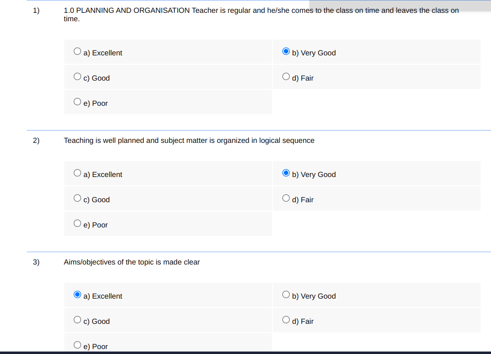

# linways-auto-feedback


> A chrome extension for filling faculty/course evaluation at one click

## Background

At the conclusion of every semester, students are required to complete faculty/course evaluations in order to access the Linways portal. If you're in a hurry to check your attendance or view your internal marks, this can be quite inconvenient. To simplify the process, I developed this extension.

## Screenshots


When good is selected 🔽




## Installing

- Download the zip from [releases](https://github.com/vivekkj123/linways-auto-feedback/releases) and extract it
- Goto `chrome://extensions`
- Enable Developer mode
- Select `load unpacked` and select that extracted folder.
- Now open the faculty/course evaluation and tryout the extension

- 3 Levels of feedback is available
  - Good - Answers will be between excellent and very good
  - Average - Answers will be between good and fair
  - Poor - Answers will be between fair and poor
## Developing

Clone the repository

run the command

```shell
$ cd linways-auto-feedback
$ npm i
$ npm run dev
```

## Contributing

Simply fork the repo and feel free to make improvements / new features. Contributions are always welcome :)

## Thanks

- [guocaoyi's Chrome extension boilerplate](https://github.com/guocaoyi/create-chrome-ext)
- [Madhav Biju's Chrome Extension](https://github.com/madhavbiju/Feedback-Filler-Chrome-Extension) (Drawback - Only Excellent can be selected. No popup screen)
