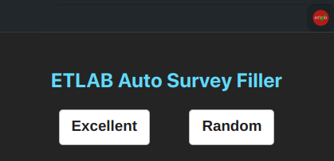

# ETLAB-Auto-Survey

Simple fork of [@vivekkj123/linways-auto-feedback](https://github.com/vivekkj123/linways-auto-feedback)


> A chrome extension for filling all surveys at one click

## Background

At the conclusion of every semester, students are required to complete faculty/course evaluations in order to access the Etlab. If you're in a hurry to check your attendance or view your internal marks, this can be quite inconvenient. To simplify the process, I developed this extension.

## Screenshots



## Installing

- Download the zip from [releases](https://github.com/vivekkj123/etlab-auto-survey/releases) and extract it
- Goto `chrome://extensions`
- Enable Developer mode
- Select `load unpacked` and select that extracted folder.
- Now open the any survey and tryout the extension

- 2 Levels of feedback is available
  - Good - Answers will be first option (Excellent in most cases)
  - Random - Answers will be Random. Use at your own risk

## Developing

Clone the repository

run the command

```shell
$ cd etlab-auto-feedback
$ npm i
$ npm run dev
```

## Contributing

Simply fork the repo and feel free to make improvements / new features. Contributions are always welcome :)

If you've found any bugs, please do report 🙌🏻
